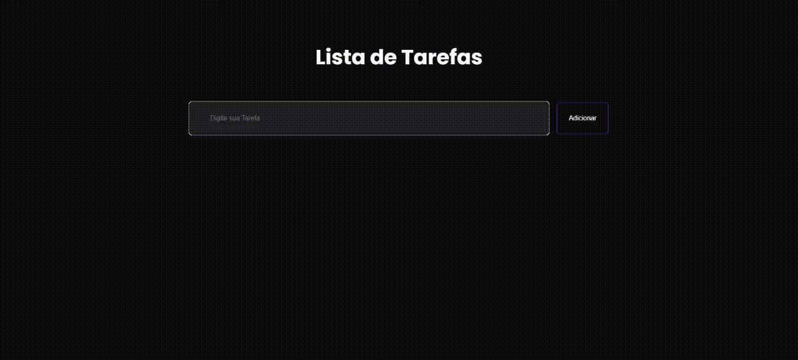

<h1 align="center">
  

Lista de Taregas apenas com JS

</h1>

<h1>

</h1>

## 📕 Sobre

Este é um projeto simples de Lista de Tarefas (To-Do List) desenvolvido com HTML, CSS e JavaScript. O objetivo deste projeto é permitir que os usuários possam adicionar, remover e gerenciar suas tarefas de forma prática e eficiente.

## Fucionalidades

- Adicionar Tarefa: Permite adicionar uma nova tarefa à lista.
- Marcar como Concluída: Permite marcar uma tarefa como concluída, alterando seu status visual.
- Remover Tarefa: Permite remover uma tarefa da lista.

## 🔨 Tools

- HTML
- CSS
- JS

